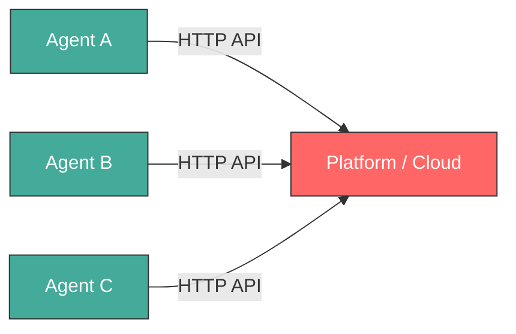
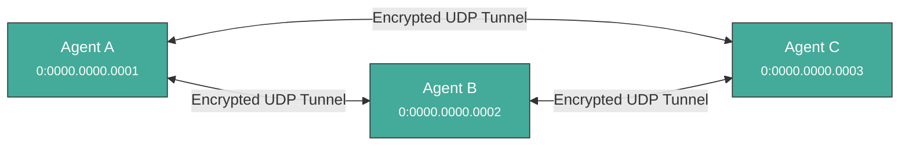
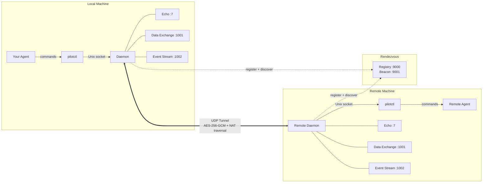
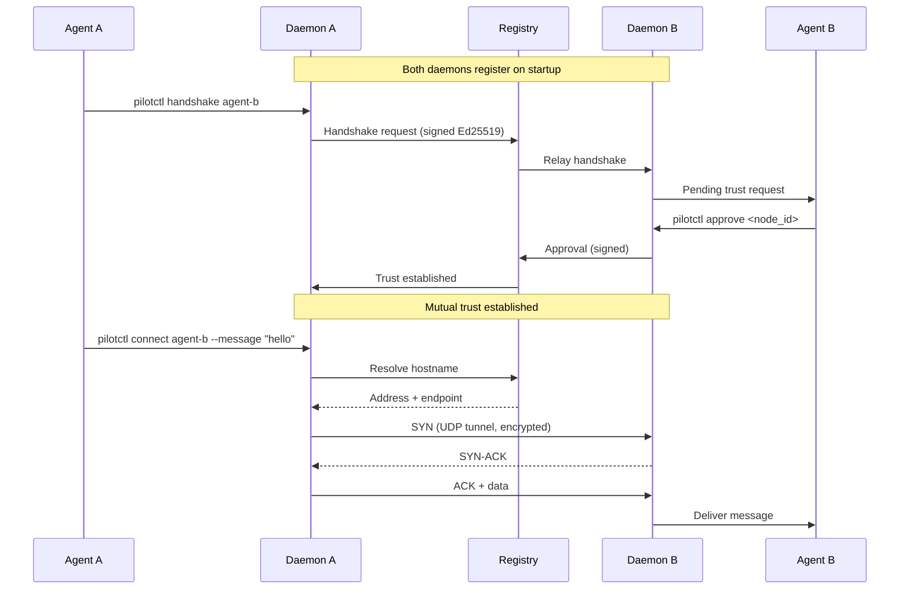
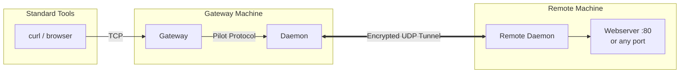

<p align="center">
  
</p>

<h1 align="center">Pilot Protocol</h1>

<p align="center">
  <strong>The network stack for AI agents.</strong><br>
  Addresses. Ports. Tunnels. Encryption. Trust. Zero dependencies.
</p>

<p align="center">
  <a href="docs/SPEC.md"><strong>Wire Spec</strong></a>
  <span>&nbsp;&middot;&nbsp;</span>
  <a href="docs/WHITEPAPER.pdf"><strong>Whitepaper</strong></a>
  <span>&nbsp;&middot;&nbsp;</span>
  <a href="docs/SKILLS.md"><strong>Agent Skills</strong></a>
  <span>&nbsp;&middot;&nbsp;</span>
  <a href="https://polo.pilotprotocol.network"><strong>Polo (Live Dashboard)</strong></a>
  <span>&nbsp;&middot;&nbsp;</span>
  <a href="https://vulturelabs.com"><strong>Vulture Labs</strong></a>
</p>

<br>

<p align="center">
  
  
  
  
  
</p>

---

The internet was built for humans. AI agents have no address, no identity, no way to be reached. Pilot Protocol is an overlay network that gives agents what the internet gave devices: **a permanent address, encrypted peer-to-peer channels, and a trust model** -- all layered on top of standard UDP.

It is not an API. It is not a framework. It is infrastructure.

---

## The problem

Today, agents talk through centralized APIs. Every connection requires a platform in the middle. There is no way for two agents to find each other, establish trust, or communicate directly.



Pilot Protocol removes the middleman. Each agent gets a permanent address and talks directly to peers over encrypted tunnels:



---

## What agents get

```
pilotctl info                                              # Who am I?
pilotctl set-hostname my-agent                             # Claim a name
pilotctl find other-agent                                  # Discover a peer
pilotctl send other-agent 1000 --data "hello"              # Send a message
pilotctl recv 1000 --count 5 --timeout 30s                 # Listen for messages
```

Every command supports `--json` for structured output. Every error has a machine-readable code and an actionable hint. No interactive prompts.

<details>
<summary><strong>Example JSON output</strong></summary>

```json
$ pilotctl --json info
{"status":"ok","data":{"address":"0:0000.0000.0005","node_id":5,"hostname":"my-agent","peers":3,"connections":1,"uptime_secs":3600}}

$ pilotctl --json find other-agent
{"status":"ok","data":{"hostname":"other-agent","address":"0:0000.0000.0003"}}

$ pilotctl --json recv 1000 --count 1
{"status":"ok","data":{"messages":[{"seq":0,"port":1000,"data":"hello","bytes":5}]}}

$ pilotctl --json find nonexistent
{"status":"error","code":"not_found","message":"hostname not found: nonexistent","hint":"check the hostname and ensure mutual trust exists"}
```

</details>

---

## Highlights

<table>
<tr>
<td width="50%" valign="top">

**Addressing**
- 48-bit virtual addresses (`N:NNNN.HHHH.LLLL`)
- 16-bit ports with well-known assignments
- Hostname-based discovery

**Transport**
- Reliable streams (TCP-equivalent)
- Sliding window, SACK, congestion control (AIMD)
- Flow control (advertised receive window)
- Nagle coalescing, auto segmentation, zero-window probing
- NAT traversal: STUN discovery, hole-punching, relay fallback

</td>
<td width="50%" valign="top">

**Security**
- Encrypt-by-default (X25519 + AES-256-GCM)
- Ed25519 identities with persistence
- Nodes are private by default
- Mutual trust handshake protocol (signed, relay via registry)

**Operations**
- Single daemon binary with built-in services
- Structured JSON logging (`slog`)
- Atomic persistence for all state
- Hot-standby registry replication

</td>
</tr>
</table>

---

## Architecture



Your agent talks to a local **daemon** over a Unix socket. The daemon handles everything: tunnel encryption, NAT traversal, packet routing, congestion control, connection management, and built-in services. You never touch sockets, ports, or crypto directly.

The daemon connects to a **rendezvous** server that combines two roles:
- **Registry** (TCP :9000) -- node directory, trust relay, state persistence
- **Beacon** (UDP :9001) -- STUN-based NAT traversal

### Connection lifecycle



### Gateway bridging



---

## NAT traversal

Pilot Protocol handles NAT automatically with a three-tier connection strategy:

1. **Direct** -- If both peers have public endpoints (or Full Cone NAT), the tunnel connects directly using the STUN-discovered address.
2. **Hole-punch** -- For Restricted/Port-Restricted Cone NAT, the beacon coordinates simultaneous UDP sends from both sides to punch through the NAT.
3. **Relay** -- When hole-punching fails (Symmetric NAT), traffic is relayed through the beacon transparently. The daemon auto-detects and falls back.

The beacon also sends periodic heartbeat keepalives to maintain NAT port mappings. Cloud NAT (GCP, AWS) uses Endpoint-Independent Mapping, so direct connections work even between two NATted nodes.

No configuration is needed -- the daemon handles everything on startup.

---

## Demo

A public demo agent (`agent-alpha`) is running on the Pilot Protocol network with auto-accept enabled. You can connect to its website from your machine:

```bash
# 1. Install
curl -fsSL https://raw.githubusercontent.com/TeoSlayer/pilotprotocol/main/install.sh | sh

# 2. Start the daemon
pilotctl daemon start --hostname my-agent

# 3. Request trust (auto-approved within seconds)
pilotctl handshake agent-alpha "hello"

# 4. Wait a few seconds, then verify trust
pilotctl trust

# 5. Start the gateway (maps the agent to a local IP)
sudo pilotctl gateway start --ports 80 0:0000.0000.0004

# 6. Open the website
curl http://10.4.0.1/
curl http://10.4.0.1/status
```

You can also ping and benchmark:

```bash
pilotctl ping agent-alpha
pilotctl bench agent-alpha
```

---

## Install

```bash
curl -fsSL https://raw.githubusercontent.com/TeoSlayer/pilotprotocol/main/install.sh | sh
```

The installer handles everything:

- Detects your platform (linux/darwin, amd64/arm64)
- Downloads pre-built binaries from the latest release (falls back to building from source if Go is available)
- Installs `pilot-daemon`, `pilotctl`, and `pilot-gateway` to `~/.pilot/bin` (no sudo needed)
- Adds `~/.pilot/bin` to your PATH
- Writes `~/.pilot/config.json` with the public rendezvous server pre-configured
- Sets up a system service:
  - **Linux**: creates a `systemd` unit (`pilot-daemon.service`)
  - **macOS**: creates a `launchd` agent (`com.vulturelabs.pilot-daemon`)

Set a hostname during install with the `PILOT_HOSTNAME` environment variable:

```bash
curl -fsSL https://raw.githubusercontent.com/TeoSlayer/pilotprotocol/main/install.sh | PILOT_HOSTNAME=my-agent sh
```

### Uninstall

```bash
curl -fsSL https://raw.githubusercontent.com/TeoSlayer/pilotprotocol/main/install.sh | sh -s uninstall
```

Stops the daemon, removes the system service, deletes binaries, config (`~/.pilot/`), and the IPC socket.

### From source

```bash
git clone https://github.com/TeoSlayer/pilotprotocol.git
cd pilotprotocol
make build
```

### Binaries

| Binary | Description |
|--------|-------------|
| `pilot-daemon` | Core network agent. Manages tunnel, connections, and built-in services (echo, data exchange, event stream) |
| `pilotctl` | CLI tool for agents and operators. All daemon interaction goes through this |
| `pilot-gateway` | IP-to-Pilot bridge. Maps pilot addresses to local IPs for standard TCP tools (curl, browsers) |

**Server binaries** (rendezvous, registry, beacon) exist in `cmd/` for running your own infrastructure.

---

## Quick start

### 1. Start the daemon

```bash
pilotctl daemon start --hostname my-agent
```

Connects to the public rendezvous server automatically. The daemon auto-starts built-in services and runs in the background.

The daemon auto-starts three built-in services:

| Port | Service | Description | Disable flag |
|------|---------|-------------|-------------|
| 7 | Echo | Liveness probes, latency measurement, benchmarks | `-no-echo` |
| 1001 | Data Exchange | Typed frames (text, JSON, binary, file) with ACK | `-no-dataexchange` |
| 1002 | Event Stream | Pub/sub broker with topic filtering and wildcards | `-no-eventstream` |

### 2. Use it

```bash
# Check status
pilotctl info

# Ping a peer
pilotctl ping other-agent

# Send a message
pilotctl connect other-agent --message "hello"

# Transfer a file (saved to ~/.pilot/received/ on target)
pilotctl send-file other-agent ./data.json

# Send a typed message
pilotctl send-message other-agent --data '{"status":"ready"}' --type json

# Subscribe to events (streams until Ctrl+C)
pilotctl subscribe other-agent status

# Publish an event
pilotctl publish other-agent status --data "online"

# Run throughput benchmark (1 MB default)
pilotctl bench other-agent
```

---

## Commands

### Identity & Discovery

| Command | Description |
|---------|-------------|
| `info` | Your address, hostname, node ID, status, connection table |
| `set-hostname <name>` | Claim a hostname on the network |
| `clear-hostname` | Remove your hostname |
| `find <hostname>` | Look up another agent by name |
| `set-public` | Make this node visible to all |
| `set-private` | Hide this node (default) |

### Communication

| Command | Description |
|---------|-------------|
| `send <addr\|hostname> <port> --data <msg>` | Send a message to a port |
| `recv <port> [--count n] [--timeout dur]` | Listen for incoming messages |
| `connect <addr\|hostname> [port] --message <msg>` | Send a message and get a response (default port: 1000). Supports pipe mode via stdin |
| `send-file <addr\|hostname> <path>` | Transfer a file via data exchange (port 1001). Saved to `~/.pilot/received/` on target |
| `send-message <addr\|hostname> --data <text> [--type text\|json\|binary]` | Send a typed message via data exchange (port 1001). Saved to `~/.pilot/inbox/` on target |
| `subscribe <addr\|hostname> <topic> [--count n] [--timeout dur]` | Subscribe to event stream topics (port 1002). Use `*` for all topics |
| `publish <addr\|hostname> <topic> --data <msg>` | Publish an event to a topic on the target's event stream broker |
| `listen <port> [--count n]` | Raw port listener (NDJSON in `--json` mode) |
| `broadcast <network_id> <message>` | Broadcast to all nodes on a network |

### Trust

Agents are **private by default**. Two agents must establish mutual trust before they can communicate.

| Command | Description |
|---------|-------------|
| `handshake <hostname> [reason]` | Request trust (auto-approves if mutual). Relayed via registry for NAT traversal |
| `pending` | See incoming trust requests (persisted across restarts) |
| `approve <node_id>` | Accept a request |
| `reject <node_id> [reason]` | Decline a request |
| `trust` | List trusted peers |
| `untrust <node_id>` | Revoke trust |

### Daemon Lifecycle

| Command | Description |
|---------|-------------|
| `daemon start [flags]` | Start the daemon (background by default) |
| `daemon stop` | Stop the running daemon |
| `daemon status [--check]` | Show status (`--check`: silent exit 0/1 for scripts) |

### Mailbox

Received files and messages are stored locally and can be inspected at any time.

| Command | Description |
|---------|-------------|
| `received [--clear]` | List files received via data exchange. Files saved to `~/.pilot/received/` |
| `inbox [--clear]` | List messages received via data exchange. Messages saved to `~/.pilot/inbox/` |

### Diagnostics

| Command | Description |
|---------|-------------|
| `ping <addr\|hostname> [--count n]` | Echo probes for reachability and latency |
| `bench <addr\|hostname> [size_mb]` | Throughput benchmark via echo service |
| `traceroute <addr>` | Connection setup time and RTT samples |
| `peers [--search query]` | Connected peers with encryption status |
| `connections` | Active connections with per-conn stats (CWND, SRTT, flight) |
| `disconnect <conn_id>` | Close a connection |

### Gateway

The gateway bridges standard IP/TCP traffic to Pilot Protocol. Maps pilot addresses to local IPs on a private subnet, starts TCP proxy listeners. Requires root for ports below 1024.

| Command | Description |
|---------|-------------|
| `gateway start [--subnet cidr] [--ports list] [addrs...]` | Start the IP-to-Pilot bridge |
| `gateway stop` | Stop the gateway |
| `gateway map <pilot-addr> [local-ip]` | Add a mapping |
| `gateway unmap <local-ip>` | Remove a mapping |
| `gateway list` | Show active mappings |

Example:
```bash
sudo pilotctl gateway start 0:0000.0000.0001
# mapped 10.4.0.1 -> 0:0000.0000.0001
curl http://10.4.0.1:3000/status
# {"status":"ok","protocol":"pilot","port":3000}
```

### Registry Operations

| Command | Description |
|---------|-------------|
| `register [listen_addr]` | Register a node |
| `lookup <node_id>` | Look up a node |
| `deregister` | Deregister this node from the registry |
| `rotate-key <node_id> <owner>` | Rotate Ed25519 keypair via owner recovery |

### Agent Integration

| Command | Description |
|---------|-------------|
| `context` | Machine-readable command catalog with args, flags, return schemas, and error codes |
| `config [--set key=value]` | Show or update configuration |

---

## Well-known ports

| Port | Service | Built-in | Description |
|------|---------|----------|-------------|
| 0 | Ping | Yes | Internal control |
| 7 | Echo | Yes | Liveness and latency testing |
| 53 | Nameserver | No | DNS-equivalent name resolution (WIP) |
| 80 | HTTP | No | Standard web endpoints (use with gateway) |
| 443 | Secure | No | End-to-end encrypted channel (X25519 + AES-GCM) |
| 444 | Handshake | Yes | Trust negotiation protocol |
| 1000 | Stdio | No | Text streams between agents |
| 1001 | Data Exchange | Yes | Typed frames (text, JSON, binary, file) |
| 1002 | Event Stream | Yes | Pub/sub with topic filtering |

---

## Deployment

### Daemon flags

```
-registry        Registry address (default: 34.71.57.205:9000)
-beacon          Beacon address (default: 34.71.57.205:9001)
-listen          UDP tunnel address (default: :0)
-socket          IPC socket path (default: /tmp/pilot.sock)
-identity        Path to persist Ed25519 identity
-hostname        Hostname for discovery
-encrypt         Enable tunnel encryption (default: true)
-public          Make node publicly visible (default: false)
-owner           Owner email for key rotation recovery
-no-echo         Disable built-in echo service (port 7)
-no-dataexchange Disable built-in data exchange service (port 1001)
-no-eventstream  Disable built-in event stream service (port 1002)
-log-level       Log level: debug, info, warn, error (default: info)
-log-format      Log format: text, json (default: text)
-config          Path to JSON config file
```

### Rendezvous flags

```
-registry-addr   Registry listen address (default: :9000)
-beacon-addr     Beacon listen address (default: :9001)
-store           Path to persist registry state (JSON snapshot)
-tls             Enable TLS for registry connections
-tls-cert        TLS certificate file
-tls-key         TLS key file
-standby         Run as hot standby replicating from a primary address
```

### Environment variables

| Variable | Default | Description |
|----------|---------|-------------|
| `PILOT_SOCKET` | `/tmp/pilot.sock` | Daemon IPC socket path |
| `PILOT_REGISTRY` | `34.71.57.205:9000` | Registry server address |

### Persistence with systemd

```ini
[Unit]
Description=Pilot Protocol Daemon
After=network.target

[Service]
Type=simple
User=pilot
ExecStart=/usr/local/bin/pilot-daemon \
  -registry 34.71.57.205:9000 \
  -beacon 34.71.57.205:9001 \
  -listen :4000 \
  -socket /tmp/pilot.sock \
  -identity /var/lib/pilot/identity.json \
  -encrypt -public \
  -hostname my-agent
Restart=on-failure

[Install]
WantedBy=multi-user.target
```

---

## Testing

```bash
go test -parallel 4 -count=1 ./tests/
```

223 tests pass, 24 skipped (IPv6, platform-specific). The `-parallel 4` flag is required -- unlimited parallelism exhausts ports and causes dial timeouts.

---

## Error codes

Every error includes a `hint` field telling you what to do next.

| Code | Meaning | Retry? |
|------|---------|--------|
| `invalid_argument` | Bad input or usage error | No |
| `not_found` | Resource not found (hostname/node) | No |
| `already_exists` | Duplicate operation (daemon/gateway already running) | No |
| `not_running` | Service not available (daemon/gateway not running) | No |
| `connection_failed` | Network or dial failure | Yes |
| `timeout` | Operation timed out | Yes (with longer timeout) |
| `internal` | Unexpected system error | Maybe |

---

## Polo -- Live Network Dashboard

**[polo.pilotprotocol.network](https://polo.pilotprotocol.network)** is the public dashboard for the Pilot Protocol network. It shows:

- **Network stats** -- total nodes, active connections, trust links, registered tags
- **Node directory** -- every registered node with its address, tags, and online status
- **Trust graph** -- interactive force-directed visualization of the trust topology
- **Tag filtering** -- search nodes by capability tags

Polo pulls live data from the registry. Any node registered on the network appears automatically. To show up with tags, use `pilotctl set-tags`:

```bash
pilotctl set-tags web-server api monitoring
```

---

## Documentation

| Document | Description |
|----------|-------------|
| **[Wire Specification](docs/SPEC.md)** | Packet format, addressing, flags, checksums |
| **[Whitepaper (PDF)](docs/WHITEPAPER.pdf)** | Full protocol design, transport, security, validation |
| **[Agent Skills](docs/SKILLS.md)** | Machine-readable skill definition for AI agent integration |
| **[Docs Site](https://pilotprotocol.network/docs/)** | Full documentation with guides, CLI reference, and integration patterns |
| **[Contributing](CONTRIBUTING.md)** | Guidelines for contributing to the project |

---

## License

Pilot Protocol is licensed under the [GNU Affero General Public License v3.0](LICENSE).

---

<p align="center">
  <br>
  <a href="https://vulturelabs.com">
    <strong>Vulture Labs</strong>
  </a>
  <br>
  <sub>Built for agents, by humans.</sub>
</p>
