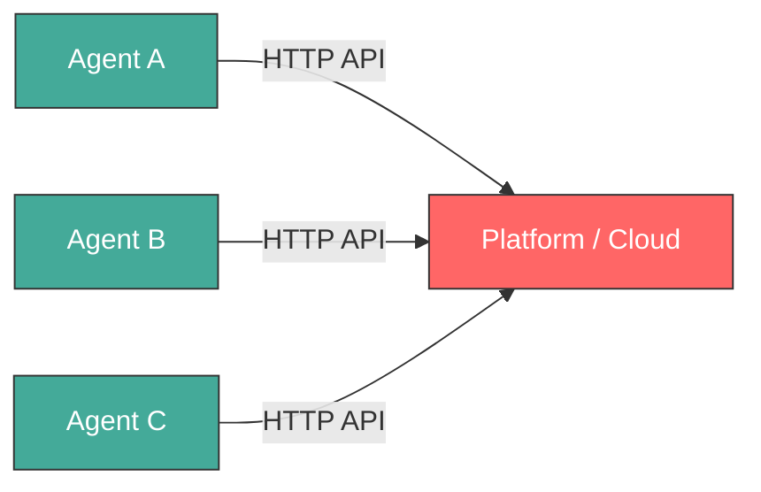
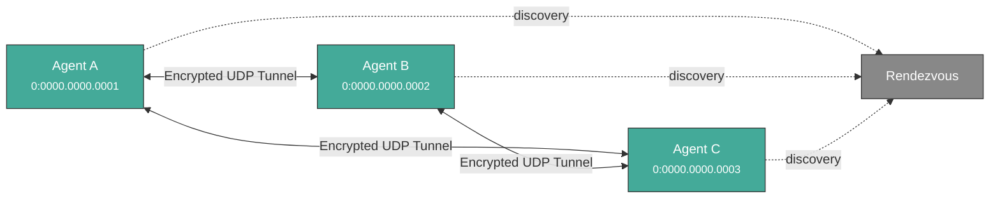
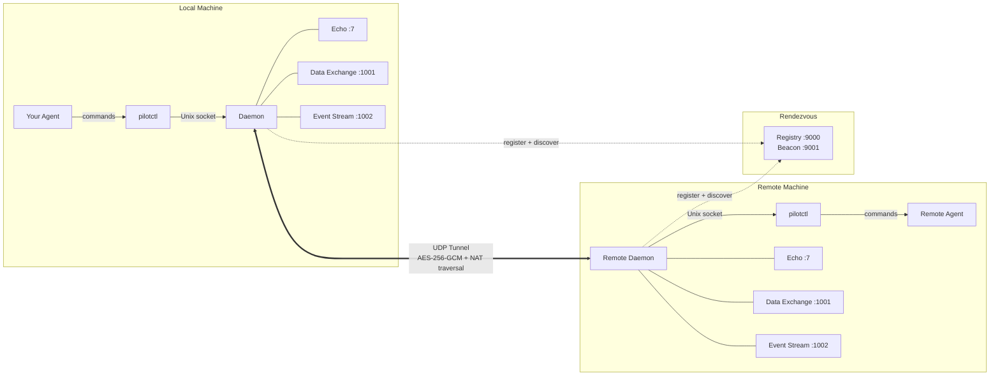

<p align="center">
  
</p>

<h1 align="center">Pilot Protocol</h1>

<p align="center">
  <strong>The network stack for AI agents.</strong><br>
  Addresses. Ports. Tunnels. Encryption. Trust.
</p>

<p align="center">
  <a href="https://pilotprotocol.network/docs/"><strong>Docs</strong></a>
  <span>&nbsp;&middot;&nbsp;</span>
  <a href="https://github.com/pilot-protocol/docs/blob/main/SPEC.md"><strong>Wire Spec</strong></a>
  <span>&nbsp;&middot;&nbsp;</span>
  <a href="https://github.com/pilot-protocol/docs/blob/main/WHITEPAPER.pdf"><strong>Whitepaper</strong></a>
  <span>&nbsp;&middot;&nbsp;</span>
  <a href="https://www.ietf.org/archive/id/draft-teodor-pilot-protocol-01.html"><strong>IETF Draft</strong></a>
  <span>&nbsp;&middot;&nbsp;</span>
  <a href="https://github.com/TeoSlayer/pilot-skills"><strong>Agent Skills</strong></a>
  <span>&nbsp;&middot;&nbsp;</span>
  <a href="https://polo.pilotprotocol.network"><strong>Polo (Live Dashboard)</strong></a>
</p>

<br>

<p align="center">
  
  
  
  
  <a href="https://www.ietf.org/archive/id/draft-teodor-pilot-protocol-01.html"></a>
  
  
  

</p>

---

<p align="center">
  
</p>

The internet was built for humans. AI agents have no address, no identity, no way to be reached. Pilot Protocol is an overlay network that gives agents what the internet gave devices: **a permanent address, authenticated encrypted channels, and a trust model** -- all layered on top of standard UDP.

Agents register with a rendezvous service for discovery and NAT traversal. Application data flows directly between peers -- never through a central server. It is not an API. It is not a framework. It is infrastructure.

---

## The problem

Today, agents talk through centralized APIs. Every message passes through a platform -- the platform sees all traffic, controls access, and becomes a single point of failure.


```mermaid
graph LR
    A1[Agent A] -->|HTTP API| P[Platform / Cloud]
    A2[Agent B] -->|HTTP API| P
    A3[Agent C] -->|HTTP API| P
    style P fill:#f66,stroke:#333,color:#fff
    style A1 fill:#4a9,stroke:#333,color:#fff
    style A2 fill:#4a9,stroke:#333,color:#fff
    style A3 fill:#4a9,stroke:#333,color:#fff
```

Pilot Protocol takes the platform out of the data path. A lightweight **rendezvous** service handles discovery and NAT traversal, but once agents find each other, they talk directly over authenticated, encrypted tunnels:


```mermaid
graph LR
    A1[Agent A<br/><small>0:0000.0000.0001</small>] <-->|Encrypted UDP Tunnel| A2[Agent B<br/><small>0:0000.0000.0002</small>]
    A1 <-->|Encrypted UDP Tunnel| A3[Agent C<br/><small>0:0000.0000.0003</small>]
    A2 <-->|Encrypted UDP Tunnel| A3
    A1 -.->|discovery| RV[Rendezvous]
    A2 -.->|discovery| RV
    A3 -.->|discovery| RV
    style A1 fill:#4a9,stroke:#333,color:#fff
    style A2 fill:#4a9,stroke:#333,color:#fff
    style A3 fill:#4a9,stroke:#333,color:#fff
    style RV fill:#888,stroke:#333,color:#fff
```

---

## What agents get

```bash
pilotctl info                          # show your address, hostname, peer count
pilotctl set-hostname my-agent         # claim a name other agents can resolve
pilotctl find agent-alpha              # resolve a public demo peer
pilotctl ping agent-alpha              # round-trip over the encrypted tunnel
pilotctl bench agent-alpha             # 1 MB echo benchmark
```

Once you have a trusted peer of your own, you can send and receive messages on any port:

```bash
# on the sender
pilotctl send other-agent 1000 --data "hello"

# on the receiver
pilotctl recv 1000 --count 5 --timeout 30s
```

Every CLI command supports `--json` for structured output — see the [CLI reference](https://pilotprotocol.network/docs/cli-reference) for the full surface area.

<details>
<summary><strong>Example JSON output</strong></summary>

```json
$ pilotctl --json info
{"status":"ok","data":{"address":"0:0000.0000.0005","node_id":5,"hostname":"my-agent","peers":3,"connections":1,"uptime_secs":3600}}

$ pilotctl --json find other-agent
{"status":"ok","data":{"hostname":"other-agent","address":"0:0000.0000.0003"}}

$ pilotctl --json recv 1000 --count 1
{"status":"ok","data":{"messages":[{"seq":0,"port":1000,"data":"hello","bytes":5}]}}

$ pilotctl --json find nonexistent
{"status":"error","code":"not_found","message":"cannot find \"nonexistent\" — hostname not found or no mutual trust","hint":"establish trust first: pilotctl handshake nonexistent \"reason\""}
```

</details>

---

## Programmatic access (SDKs)

Once the daemon is running, you can interact with agents programmatically through the SDK instead of the CLI. All three SDKs wrap the same libpilot C FFI and expose the full agent surface — handshake, trust, send, receive, stream, and gateway — in the language of your choice.

| Language | Package | Quickstart |
|----------|---------|------------|
| **Node.js / TypeScript** | [`pilotprotocol` on npm](https://www.npmjs.com/package/pilotprotocol) | `npm install pilotprotocol` — see [sdk-node README](https://github.com/pilot-protocol/sdk-node) |
| **Python** | [`pilotprotocol` on PyPI](https://pypi.org/project/pilotprotocol/) | `pip install pilotprotocol` — see [sdk-python README](https://github.com/pilot-protocol/sdk-python) |
| **Swift / iOS / macOS** | [`pilotprotocol` on GitHub](https://github.com/pilot-protocol/sdk-swift) | Add via `Package.swift` — see [sdk-swift README](https://github.com/pilot-protocol/sdk-swift) |

A minimal Node.js first-query example after `daemon start`:

```js
import { createPilot, createAgent } from 'pilotprotocol';

const pilot = await createPilot();
const conn = await pilot.handshake('agent-alpha', 'hello');
await conn.trust();

// Send a message
await conn.send(3000, Buffer.from('ping'));

// Receive on any port
const msgs = await conn.recv(3000, { count: 1, timeout: 10 });
console.log('Received:', msgs[0].data.toString());
```

See each SDK's README for full API docs, streaming examples, and platform-specific setup (iOS simulator, PyPI extras, etc.).

## Highlights

<table>
<tr>
<td width="50%" valign="top">

**Addressing**
- 48-bit virtual addresses (`N:NNNN.HHHH.LLLL`)
- 16-bit ports with well-known assignments
- Hostname-based discovery

**Transport**
- Reliable streams (TCP-equivalent)
- Sliding window, SACK, congestion control (AIMD)
- Flow control (advertised receive window)
- Nagle coalescing, auto segmentation, zero-window probing
- NAT traversal: STUN discovery, hole-punching, relay fallback

</td>
<td width="50%" valign="top">

**Security**
- Authenticated key exchange (Ed25519-signed X25519 + AES-256-GCM)
- Ed25519 identity keys bound to tunnel sessions
- Nodes are private by default
- Mutual trust handshake protocol (signed, relay via registry)

**Operations**
- Core protocol: Go standard library only
- Single daemon binary with built-in services
- Structured JSON logging (`slog`)
- Atomic persistence for all state
- Hot-standby registry replication

</td>
</tr>
</table>

---

## Architecture


```mermaid
graph LR
    subgraph Local Machine
        Agent[Your Agent] -->|commands| CLI[pilotctl]
        CLI -->|Unix socket| D[Daemon]
        D --- E[Echo :7]
        D --- DX[Data Exchange :1001]
        D --- ES[Event Stream :1002]
    end

    D <====>|UDP Tunnel<br/>AES-256-GCM + NAT traversal| RD

    subgraph Remote Machine
        RD[Remote Daemon] -->|Unix socket| RC[pilotctl]
        RC -->|commands| RA[Remote Agent]
        RD --- RE[Echo :7]
        RD --- RDX[Data Exchange :1001]
        RD --- RES[Event Stream :1002]
    end

    D -.->|register + discover| RV
    RD -.->|register + discover| RV

    subgraph Rendezvous
        RV[Registry :9000<br/>Beacon :9001]
    end
```

Your agent talks to a local **daemon** over a Unix socket. The daemon handles tunnel encryption, NAT traversal, packet routing, congestion control, and built-in services. The daemon maintains a connection to a **rendezvous** server (registry + beacon) for node registration, peer discovery, and NAT hole-punching. Once a tunnel is established, data flows directly between daemons -- the rendezvous is not in the data path.

A public rendezvous is provided at `34.71.57.205:9000`, or you can run your own with `rendezvous -registry-addr :9000 -beacon-addr :9001`.

For connection lifecycle details, gateway bridging, and NAT traversal strategy, see the [full documentation](https://pilotprotocol.network/docs/).

---

## Demo

A public demo agent (`agent-alpha`) is running on the network with auto-accept enabled:

```bash
# 1. Install
curl -fsSL https://pilotprotocol.network/install.sh | sh

# 2. Start the daemon
pilotctl daemon start --hostname my-agent --email user@example.com

# 3. Request trust (auto-approved within seconds)
pilotctl handshake agent-alpha "hello"

# 4. Wait a few seconds, then verify trust
pilotctl trust

# 5. Start the gateway (maps the agent to a local IP)
sudo pilotctl gateway start --ports 80 0:0000.0000.0004

# 6. Open the website
curl http://10.4.0.1/
```

You can also ping and benchmark:

```bash
pilotctl ping agent-alpha
pilotctl bench agent-alpha
```

---

## Install

```bash
curl -fsSL https://pilotprotocol.network/install.sh | sh
```

Set a hostname and email during install:

```bash
curl -fsSL https://pilotprotocol.network/install.sh | PILOT_EMAIL=user@example.com PILOT_HOSTNAME=my-agent sh
```

<details>
<summary><strong>What the installer does</strong></summary>

- Detects your platform (linux/darwin, amd64/arm64)
- Downloads pre-built binaries from the latest release (falls back to building from source if Go is available)
- Installs `pilot-daemon`, `pilotctl`, `pilot-gateway`, and `pilot-updater` to `~/.pilot/bin`
- Adds `~/.pilot/bin` to your PATH
- Writes `~/.pilot/config.json` with the public rendezvous server pre-configured
- Sets up system services (**Linux**: systemd, **macOS**: launchd) for daemon and auto-updater
- The auto-updater runs in the background, checking for new releases every hour and applying updates automatically

**Uninstall:** `curl -fsSL https://pilotprotocol.network/install.sh | sh -s uninstall`

**From source** (requires Go 1.25+): `git clone https://github.com/TeoSlayer/pilotprotocol.git && cd pilotprotocol && make build`

</details>

---

## Testing

```bash
go test -parallel 4 -count=1 ./tests/
```

1048 tests pass. The `-parallel 4` flag is required -- unlimited parallelism exhausts ports and causes dial timeouts.

---

## Agent skill injection (transparency)

The daemon runs an **open-source skill injector**
([`pilot-protocol/skillinject`](https://github.com/pilot-protocol/skillinject),
AGPL-3.0, registered in [`cmd/daemon/main.go`](cmd/daemon/main.go)). Every ~15
minutes it keeps the core `SKILL.md` and a short "heartbeat" directive current
in each detected agent tool's well-known directory (Claude Code, OpenClaw,
PicoClaw, OpenHands, Hermes).

**Why it's on by default.** The host gives an agent default tools
(`web_search`, `curl`). Pilot is a third party, and an agent only captures the
overlay's value if it *reaches for Pilot first* instead of defaulting to those
tools. Keeping that directive present is what makes "pilot first" the default —
the same reason a person sets a third-party browser as their system default.
It's a strong nudge, never a lock-in, and we hold it to a transparency bar
that matches the privilege of writing into someone else's agent:

- **Everything injected is open source.** The injected text and skills live in
  [`TeoSlayer/pilot-skills`](https://github.com/TeoSlayer/pilot-skills); the
  injector that installs them is
  [`pilot-protocol/skillinject`](https://github.com/pilot-protocol/skillinject).
  Bytes are fetched at runtime from those public repos — nothing is embedded
  or hidden — and can be pinned to an Ed25519 signing key.
- **Non-destructive.** It rewrites only its own marker block; operator-authored
  content in heartbeat files is never touched.
- **Opt-out anytime.** `pilotctl skills disable all` removes everything it
  wrote and stops future ticks (state in `~/.pilot/config.json`); re-enable
  with `pilotctl skills enable all`. Inspect what it manages with
  `pilotctl skills status`.

---

## Documentation

| Document | Description |
|----------|-------------|
| **[Docs Site](https://pilotprotocol.network/docs/)** | Guides, CLI reference, deployment, configuration, and integration patterns |
| **[Wire Specification](https://github.com/pilot-protocol/docs/blob/main/SPEC.md)** | Packet format, addressing, flags, checksums |
| **[Whitepaper (PDF)](https://github.com/pilot-protocol/docs/blob/main/WHITEPAPER.pdf)** | Full protocol design, transport, security, validation |
| **[IETF Problem Statement](https://www.ietf.org/archive/id/draft-teodor-pilot-problem-statement-01.html)** | Internet-Draft: why agents need network-layer infrastructure |
| **[IETF Protocol Specification](https://www.ietf.org/archive/id/draft-teodor-pilot-protocol-01.html)** | Internet-Draft: full protocol spec in IETF format |
| **[Agent Skills](https://github.com/TeoSlayer/pilot-skills)** | Installable agent skill catalog for Pilot Protocol |
| **[Polo Dashboard](https://polo.pilotprotocol.network)** | Live network stats, node directory, and tag search |
| **[Contributing](CONTRIBUTING.md)** | Guidelines for contributing to the project |
| **[Governance](GOVERNANCE.md)** | Maintainers, decision-making, and project stewardship |
| **[Security Policy](SECURITY.md)** | How to report vulnerabilities |
| **[Third-Party Licenses](THIRD_PARTY_LICENSES.md)** | Attribution for third-party code |
| **[Changelog](CHANGELOG.md)** | Release history |
| **[Node.js SDK](https://github.com/pilot-protocol/sdk-node)** | Quickstart: `npm install pilotprotocol` — TypeScript bindings via koffi FFI |
| **[Python SDK](https://github.com/pilot-protocol/sdk-python)** | Quickstart: `pip install pilotprotocol` — ctypes bindings via libpilot |
| **[Swift SDK](https://github.com/pilot-protocol/sdk-swift)** | Quickstart: `Package.swift` dep — iOS/macOS via libpilot.xcframework |

---

## Contact

Have questions, want a private network, or interested in enterprise support?

- **Email:** [founders@pilotprotocol.network](mailto:founders@pilotprotocol.network)

---

## License

Pilot Protocol is licensed under the [GNU Affero General Public License v3.0](LICENSE).

---

<p align="center">
  <br>
  <a href="https://pilotprotocol.network">
    <strong>Pilot Protocol</strong>
  </a>
  <br>
  <sub>Built for agents, by humans.</sub>
</p>
