# Pilot Protocol — Architecture & Data Pathways

Mermaid diagrams + component reference, grouped by concern. Each section introduces the component, shows its pathway, and lists the files, state, and invariants so two sibling components can be compared without hunting.

---

## 1 · Conceptual model

Pilot layers three planes over raw UDP:

- **Addressing plane** — stable 48-bit identifier (16-bit network + 32-bit node). IP:port can change as NAT mappings expire; the Pilot address cannot.
- **Control plane** — Rendezvous (registry TCP + beacon UDP, optionally replicated) holds the directory, trust pairs, and orchestrates NAT traversal. Authoritative for the `nodeID ↔ Ed25519 pubkey` binding.
- **Data plane** — TCP-like semantics (SYN/ACK/FIN, cwnd, SACK, three-phase reassembly) implemented in user space inside the daemon, carried over UDP with a 34-byte header. Optionally AES-GCM wrapped.

Applications never touch UDP. They speak IPC to a local daemon; the daemon owns the socket, the crypto, the FSM, and the traversal decisions. That's why an SDK in any language can interoperate without re-implementing the wire protocol.

---

## 2 · Primitives

### 2.1 Address — `pkg/protocol/address.go`
48-bit value: `NetworkID u16 | NodeID u32`, big-endian on the wire (6 bytes). Text form `N:NNNN.HHHH.LLLL`. Every packet carries both Src and Dst. `NetworkID` lets multiple logical networks coexist on the same rendezvous.

### 2.2 Packet header — `pkg/protocol/packet.go`

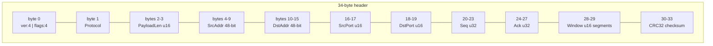

- **Flags** (byte 0 low nibble): `SYN=1 · ACK=2 · FIN=4 · RST=8`.
- **Protocol** (byte 1): `Stream=1 · Datagram=2 · Control=3`.
- **Checksum**: CRC32 over (header-with-zeroed-checksum) + payload.
- **Window** is in MSS-sized segments, not bytes.

### 2.3 Tunnel framing magic — `pkg/protocol/header.go`

First 4 bytes of every UDP payload; receiver dispatches on this tag before parsing the header:

| Magic | Hex | Meaning |
|---|---|---|
| PILT | `0x50494C54` | plaintext Pilot packet |
| PILS | `0x50494C53` | encrypted Pilot packet (AES-GCM → decrypts to a PILT frame) |
| PILK | `0x50494C4B` | ECDH key exchange |
| PILA | `0x50494C41` | authenticated key exchange |
| PILP | `0x50494C50` | NAT hole-punch (4B only, no header) |

### 2.4 Identity
Ed25519 keypair at `~/.pilot/identity.json`. Node ID is bound to the pubkey in the registry. All heartbeats carry an Ed25519 signature. Trust handshakes bind peer ID pairs + timestamps with a second Ed25519 sig to prevent cross-peer replay.

### 2.5 Flow control constants — `pkg/daemon/ports.go:102-118`

`MSS=4096 · InitialCongWin=40KB · InitialRTO=1s · RTOMin=200ms · RTOMax=10s · MaxOOOBuf=128 · ClockGranularity=10ms`.

---

## 3 · Process topology

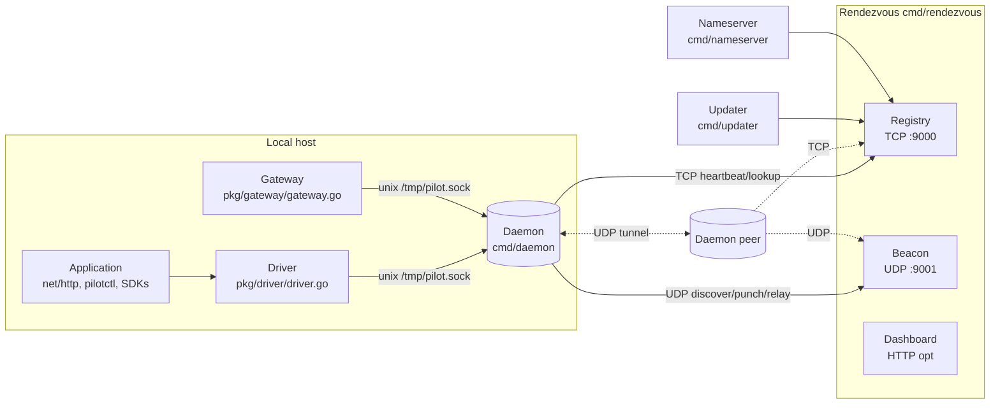

**Daemon** (`cmd/daemon/main.go`) — listens UDP for tunnel, Unix socket for IPC. Reserved system ports: 7 (echo), 80/443 (HTTP/S), 444 (trust handshake), 1000 (stdio), 1001 (data exchange), 1002 (event stream).

**Rendezvous** (`cmd/rendezvous/main.go`) — single binary = registry + beacon + optional dashboard/standby. Flags: `-registry-addr :9000`, `-beacon-addr :9001`, `-http`, `-standby`, `-store`. Canonical GCP instance `34.71.57.205:9000/9001`.

**Pilotctl / SDKs / Gateway** — IPC clients. They never open UDP themselves, which is what makes them safe on hosts that shouldn't.

---

## 4 · Control plane

### 4.1 Registry — `pkg/registry/`

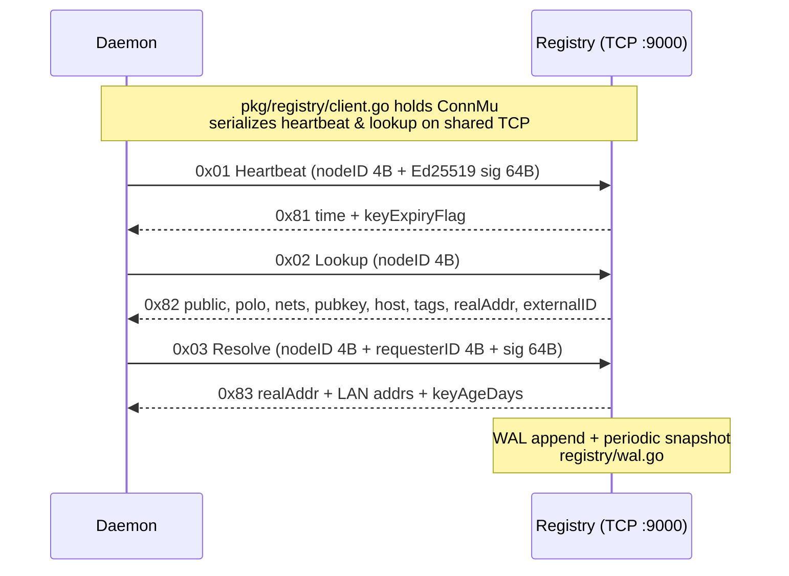

**Purpose.** Node directory, identity binding, trust pairs.
**Persistence.** WAL + periodic snapshot. Canonical path `/var/lib/pilot/registry.json` on the GCP rendezvous VM.
**Mutex.** Every op takes `ConnMu` so concurrent lookups don't interleave binary/JSON frames on the shared TCP socket.
**Files.** `server.go`, `client.go`, `wire.go` (message layouts at lines 136-233 lookup, 237-286 resolve), `wal.go`.

### 4.2 Beacon — `pkg/beacon/`

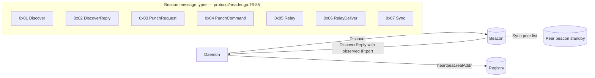

Endpoint discovery is implicit STUN: the beacon observes `src IP:port` of the Discover datagram and echoes it back in DiscoverReply. The daemon stores it and publishes via registry heartbeat.

**Workers.** `runtime.NumCPU()*2` relay workers draining a 131K-slot queue (`beacon/server.go:128-134`).
**Node TTL.** 10 minutes.

### 4.3 NAT traversal

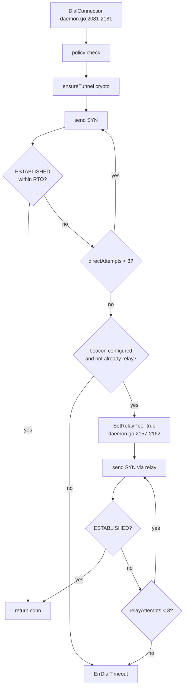

Retries: `DialDirectRetries=3`, `DialMaxRetries=6`. RTO: `DialInitialRTO=1s` initial, `DialMaxRTO=8s` max, exponential backoff; reset to initial when switching to relay (`daemon.go:2162`).

#### 4.3a Hole-punch sequence

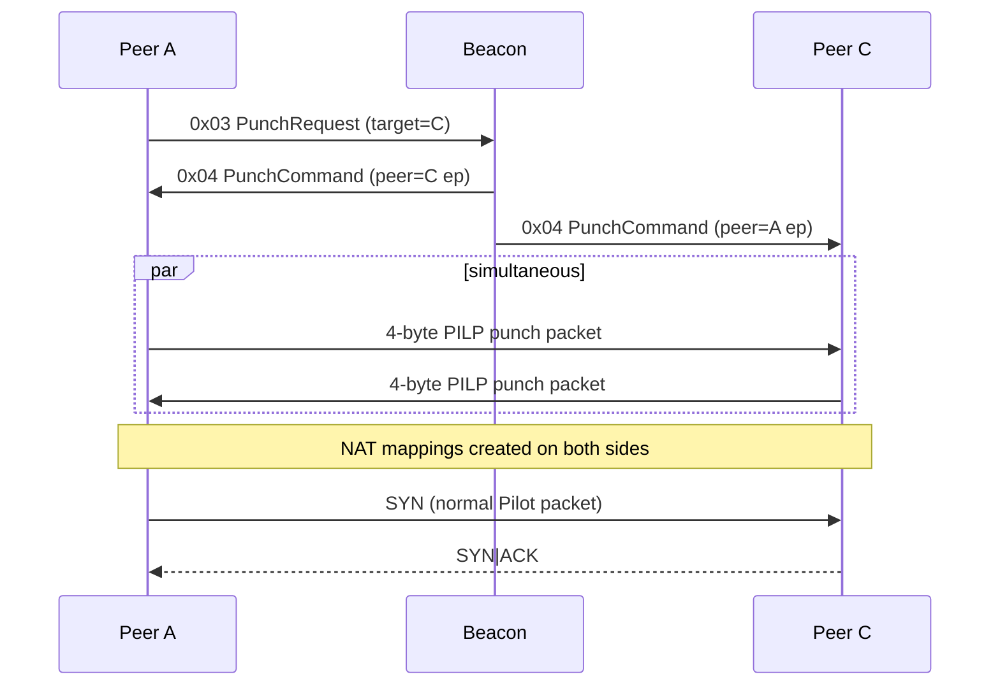

#### 4.3b Relay fallback

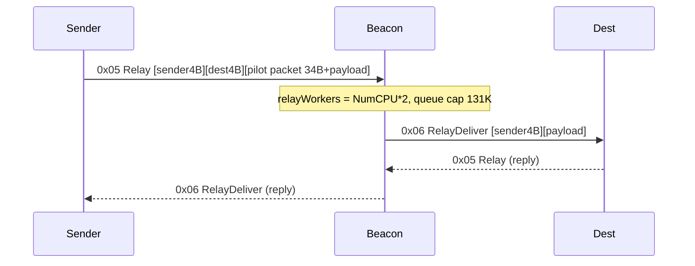

**Escalation is monotonic.** Within a single Dial: direct → hole-punch → relay, never the reverse.

### 4.4 Trust handshake — `pkg/daemon/handshake.go`

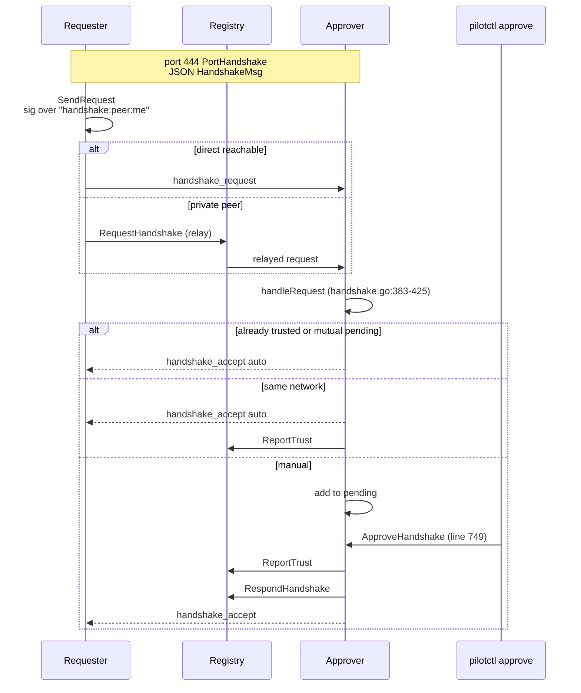

**Purpose.** Mutual *authorization*, orthogonal to the *confidentiality* layer (§6). PILK/PILA gives you a confidential channel to anyone; this says whether you should have one.
**Registry role.** Not a mediator for approval. It (a) relays handshakes for peers that can't accept inbound on 444, (b) records approved pairs (`ReportTrust`), (c) enforces trust on authorize-resolve.
**Transport.** Port 444, JSON `HandshakeMsg{type,node_id,public_key,justification,signature,reason,timestamp}`.

---

## 5 · Data plane

### 5.1 Connection state machine — `pkg/daemon/ports.go:192-203`

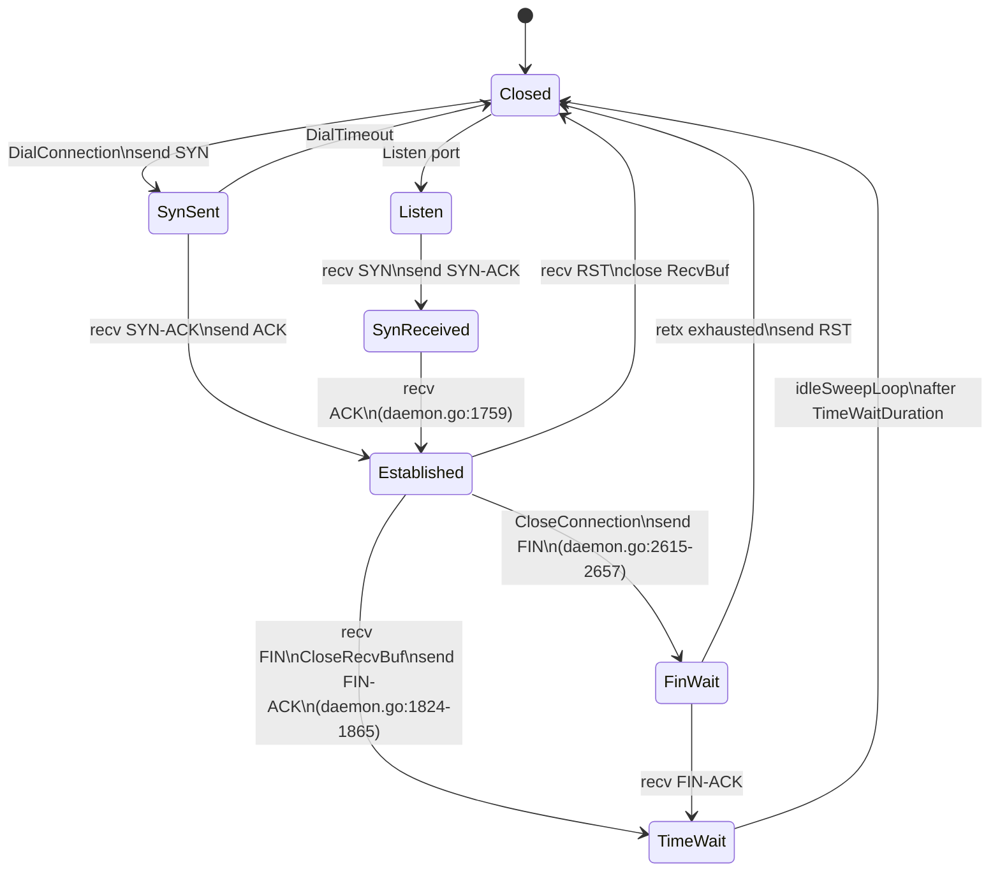

Enum: `Closed · Listen · SynSent · SynReceived · Established · FinWait · CloseWait · TimeWait` (iota).

### 5.2 Send path

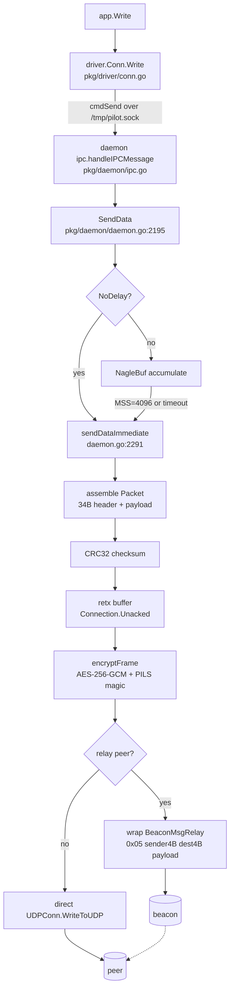

**Windowing.** Receiver advertises window in segments (`conn.RecvWindow()`); sender tracks peer budget in bytes (`conn.PeerRecvWin`, updated on every ACK).

### 5.3 Receive path

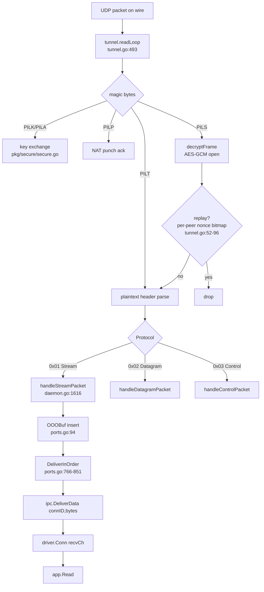

### 5.4 Retransmission + congestion control

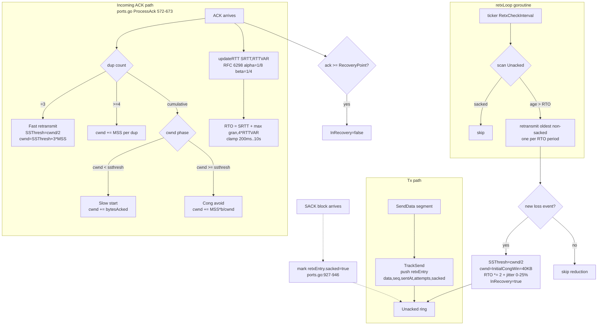

**SACK format.** 4-byte magic + 1-byte count + N×8 bytes (Left, Right), max 4 blocks (RFC).

### 5.5 Out-of-order reassembly — three-phase `DeliverInOrder`

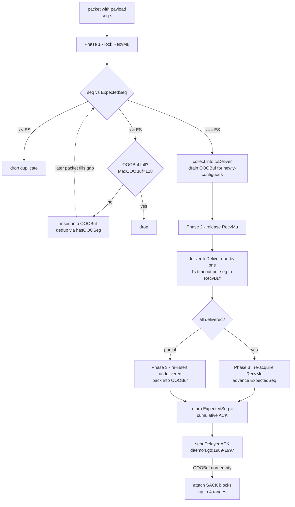

**FIXED-001 (RecvBuf sequence leak).** Phase-2 releases `RecvMu` so blocking delivery to RecvBuf can't deadlock with the sender's ACK-update path. Phase-3 only advances `ExpectedSeq` for segments actually delivered.

### 5.6 Graceful close

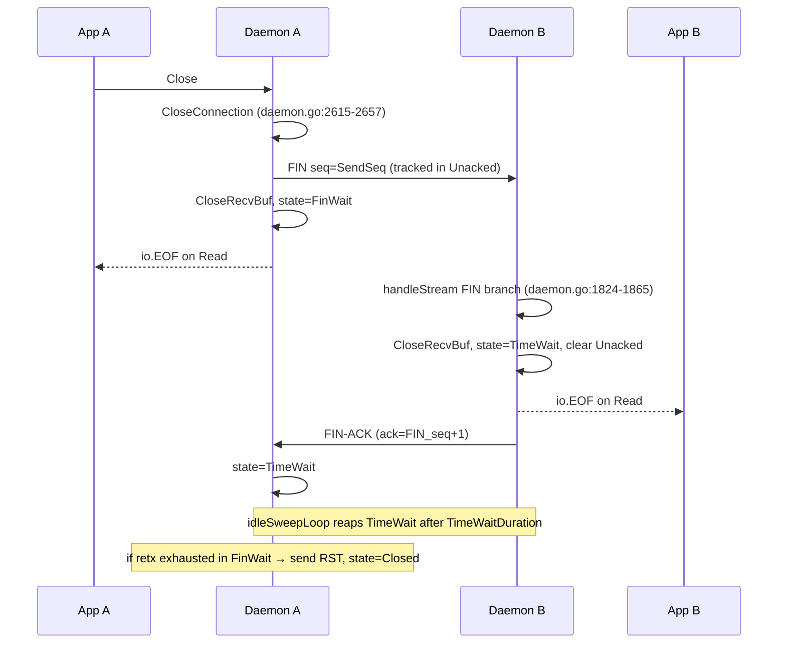

**`io.EOF` is load-bearing.** Go's HTTP body reader requires the exact sentinel — a wrapped error breaks response parsing. `CloseRecvBuf` → `recvCh` close → `Read` returns `io.EOF`, paired with `CmdCloseOK` so both sides unblock promptly.

---

## 6 · Cryptography — `pkg/secure/`

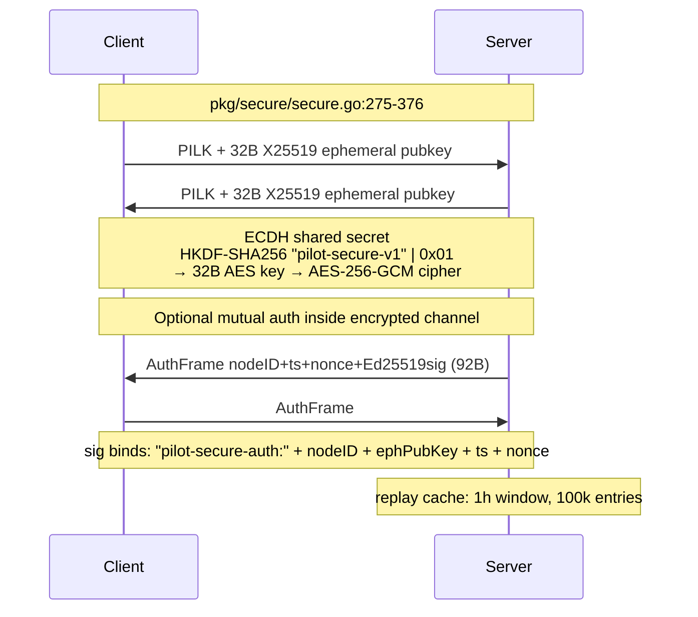

**Per-packet.** 12-byte nonce = `prefix(4B role) || counter(8B)`, AAD = prefix. Server prefix `0x00000001`, client `0x00000002` — disjoint nonce spaces so both sides can send concurrently without collision.

**Forward secrecy.** X25519 keys are ephemeral; an attacker recording ciphertext gets nothing from compromising a long-term key.

**Rekey.** Not automatic. Triggered by decrypt failure (`encrypted packet but no key`). Rate-limited 3s per peer (`tunnel.go:191,209`).

---

## 7 · Client surface

### 7.1 Driver & IPC — `pkg/driver/`

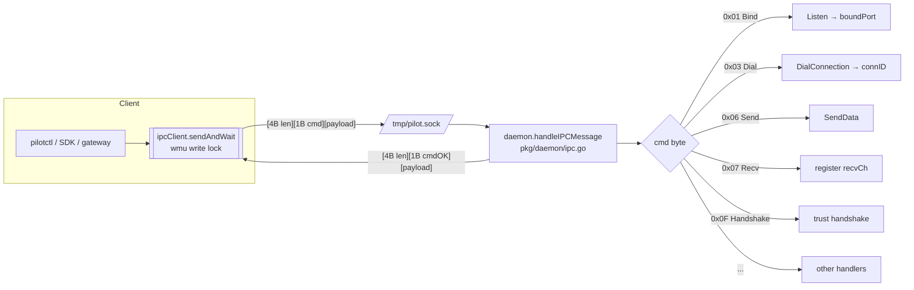

**Wire format.** `[4B len][1B cmd][payload]`. JSON for control, raw bytes for data.
**Write mutex.** `ipcConn` serializes multi-frame commands so responses don't interleave.
**Deadlines.** `SetReadDeadline` starts a timer goroutine that closes `deadlineCh`; `Read` blocks in a `select` over `recvCh + deadlineCh`.
**Remote close.** Daemon sends `CmdCloseOK` when peer FIN arrives → driver closes `recvCh` → next `Read` returns `io.EOF`.

### 7.2 HTTP-over-Pilot

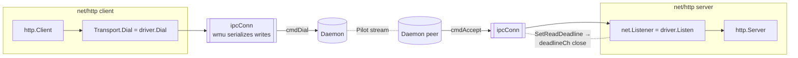

Bugs previously fixed (all in driver, referenced by memory): `ipcConn` write-mutex; `Conn.Read` returning `io.EOF` (not `fmt.Errorf`); `SetReadDeadline` actually aborting blocked reads; remote close propagation via `CmdCloseOK`.

### 7.3 Gateway — `pkg/gateway/`

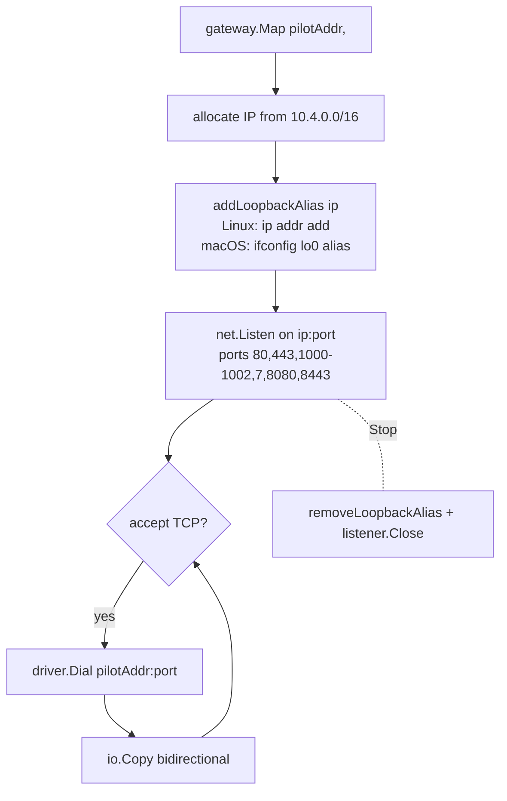

Bridges legacy IP apps into the overlay without code changes. Linux ports <1024 need root. Aliases must be torn down on `Stop()` or they persist.

### 7.4 SDKs — `sdk/`
Language wrappers around IPC: Go (native driver), Node (`@pilotprotocol/node-sdk`), Python (`pilotprotocol`). Each re-implements the IPC client only; none re-implements the wire protocol or crypto.

---

## 8 · Applications

---

## 9 · Operations

### 9.1 Updater — `pkg/updater/` + `cmd/updater/`

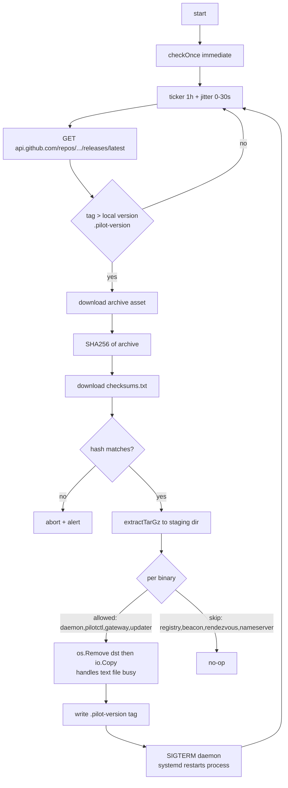

**Safety rail.** Only client binaries are updateable. Server binaries (`registry, beacon, rendezvous, nameserver`) are explicitly skipped — a bad release cannot auto-roll the rendezvous.

### 9.2 Integration test harness — `tests/integration/local/`

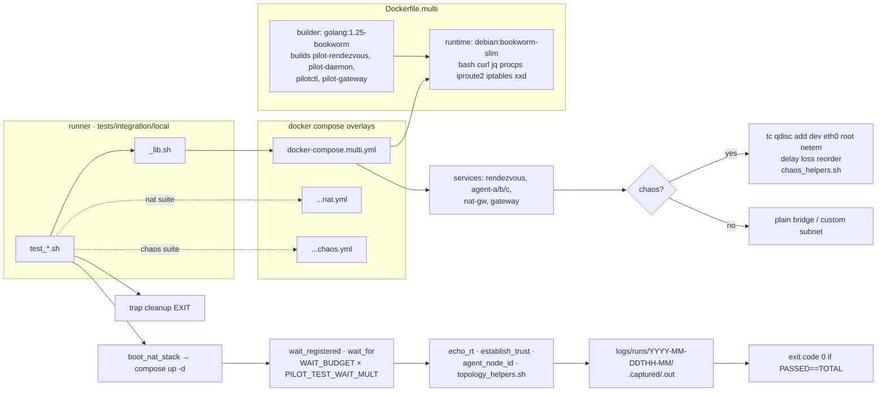

**Chaos injection:** `tc netem` inside containers (NET_ADMIN in compose); `sch_netem` kernel module required. **NAT suites** use iptables inside a dedicated `nat-gw` service to emulate full-cone / restricted / symmetric cones.

---

## 10 · End-to-end flows

### 10.1 Cold start
1. Daemon loads Ed25519 identity from `~/.pilot/identity.json`.
2. Opens **temp** UDP socket → Discover to beacon → DiscoverReply returns external `(IP:port)`.
3. Closes temp socket; binds real UDP socket on the same port.
4. Spawns `readLoop`, `retxLoop`, `idleSweepLoop`, heartbeat ticker, delayed-ACK timer.
5. TCP to registry; signed Heartbeat with external endpoint published.
6. IPC listener up.

### 10.2 A dial, end-to-end

```mermaid
sequenceDiagram
  participant App as App
  participant Drv as Driver
  participant DA as Daemon A
  participant DB as Daemon B
  participant AppB as Peer app

  App->>Drv: Dial(addr)
  Drv->>DA: cmdDial(addr) via /tmp/pilot.sock
  DA->>DA: DialConnection (daemon.go:2081)
  DA->>DA: ensureTunnel
  DA->>DB: PILK ephemeral pubkey (UDP)
  DB-->>DA: PILK ephemeral pubkey
  opt authenticated KEX
    DA->>DB: PILA AuthFrame (Ed25519)
    DB-->>DA: PILA AuthFrame
  end
  Note over DA,DB: HKDF → AES-256-GCM cipher, PILS from here on
  loop directRetries < 3
    DA->>DB: SYN
    alt SYN/ACK within RTO (1s..8s exp backoff)
      DB-->>DA: SYN/ACK
      DA->>DB: ACK
      Note over DA,DB: Established
    else RTO elapses
      DA->>DA: rto *= 2 (cap DialMaxRTO=8s)
    end
  end
  alt direct failed & beacon configured
    DA->>DA: SetRelayPeer(true) (daemon.go:2157-2162)
    loop relayAttempts < 3
      DA->>DB: SYN (via beacon 0x05 Relay)
      DB-->>DA: SYN/ACK (0x06 RelayDeliver)
      DA->>DB: ACK
    end
  else still failing
    DA-->>Drv: ErrDialTimeout
  end
  DA-->>Drv: connID
  Drv-->>App: Conn
```

### 10.3 Becoming reachable
The daemon's external endpoint comes from the beacon, publishes via registry heartbeat. A peer looking you up gets your current `realAddr`. If direct fails, the peer asks the beacon to coordinate a punch; if both NATs are symmetric, the peer flips to relay.

### 10.4 Trust lifecycle
1. `pilotctl handshake <peer>` → `SendRequest` (direct 444 or registry-relayed).
2. Approver's daemon files to `pending`.
3. `pilotctl approve <request>` → `ApproveHandshake` → `regConn.ReportTrust` → `sendAccept`.
4. Both sides see each other in network membership on subsequent lookups.
5. Revoke uses same message shape with `type=handshake_revoke`.

### 10.5 Version upgrade
Updater ticks hourly → new tag → SHA256 match → replace client binaries → SIGTERM daemon → systemd restarts. Rendezvous is never touched.

---

## 11 · Invariants at a glance

- **Nonce prefix disjoint.** Server `0x00000001`, client `0x00000002`.
- **STUN before tunnel.** Discovery uses a temp socket; the real socket binds afterward on the same port.
- **Registry ops serialized** on a single TCP conn via `ConnMu`.
- **Phase-2 of DeliverInOrder drops the lock.** Otherwise RecvBuf blocking deadlocks with the ACK path (FIXED-001).
- **`ExpectedSeq` advances only after confirmed delivery** (Phase-3).
- **Client binaries are updateable; server binaries are not.**
- **Trust ≠ crypto.** PILK/PILA = confidentiality. Trust handshake on port 444 = authorization.
- **NAT escalation is monotonic.** Direct → hole-punch → relay, never the reverse within a single Dial.
- **`io.EOF` is load-bearing.** Go HTTP's body reader requires the exact sentinel.

---

## 12 · File index

| Concern | Paths |
|---|---|
| Packet header / address / checksum | `pkg/protocol/packet.go`, `address.go`, `header.go`, `checksum.go` |
| Daemon core | `pkg/daemon/daemon.go` (Dial, handleStreamPacket, SendData), `ipc.go`, `handshake.go` |
| Tunnel I/O | `pkg/daemon/tunnel.go` (TunnelManager, readLoop, writeFrame, crypto state) |
| Connection / retx / cwnd | `pkg/daemon/ports.go` (Connection, retxEntry, flow control constants) |
| Crypto | `pkg/secure/secure.go` (ECDH, AES-GCM, Ed25519 auth) |
| Registry | `pkg/registry/server.go`, `client.go`, `wire.go`, `wal.go` |
| Beacon | `pkg/beacon/server.go`, `pkg/protocol/header.go` (msg type constants) |
| Driver / IPC | `pkg/driver/driver.go` (public API), `conn.go`, `ipc.go` |
| Gateway | `pkg/gateway/gateway.go` |
| Updater | `pkg/updater/updater.go`, `cmd/updater/main.go` |
| Rendezvous binary | `cmd/rendezvous/main.go` |
| Pilotctl | `cmd/pilotctl/main.go` |
| Nameserver | `cmd/nameserver/main.go` |
| Integration tests | `tests/integration/local/*.sh`, `Dockerfile.multi`, `docker-compose.multi*.yml` |
